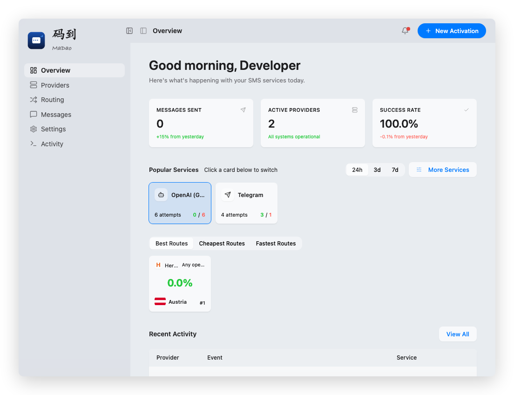
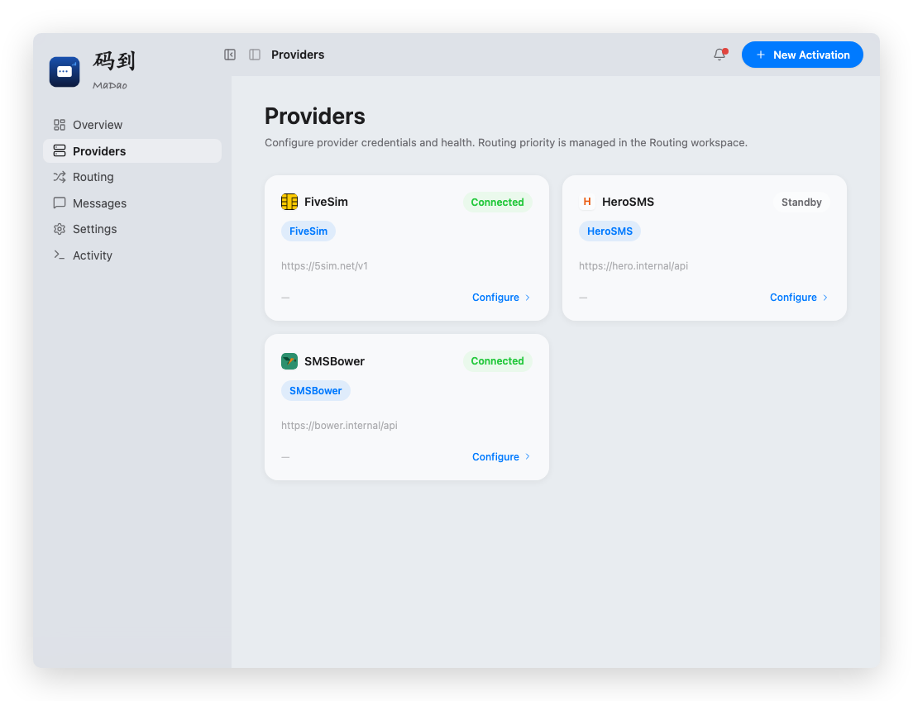
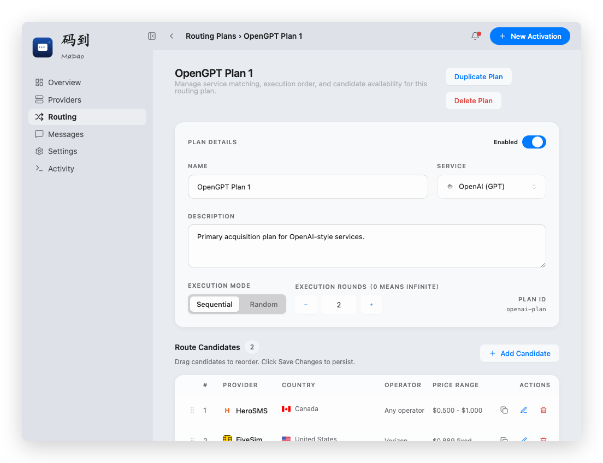
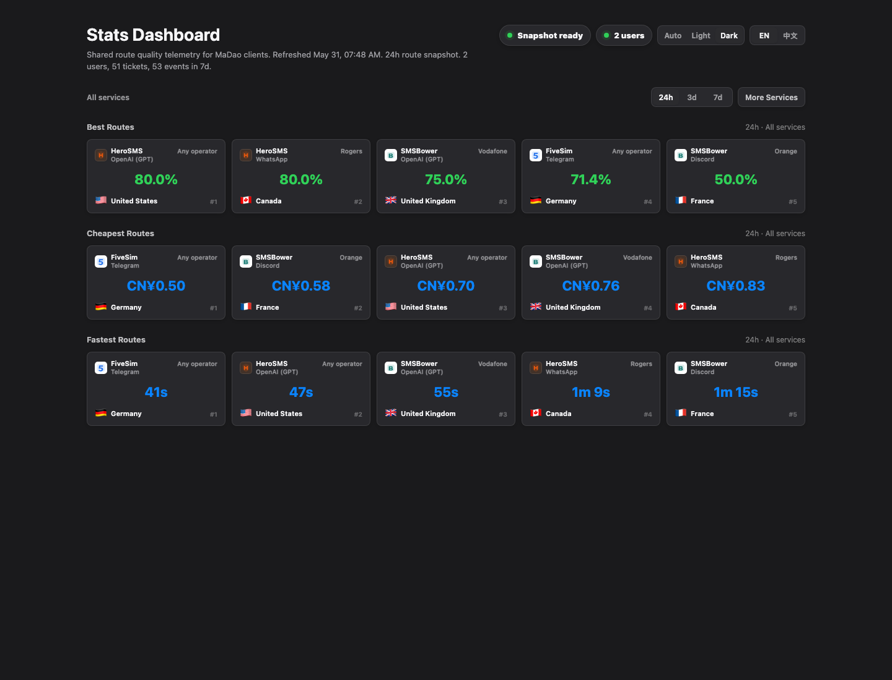

# MaDao

<p align="center">
  <strong>A unified SMS verification tool built with Rust + Tauri 2.</strong>
</p>

<p align="center">
  <a href="./README.md">English</a> ·
  <a href="./docs/README.zh-CN.md">简体中文</a>
</p>

<p align="center">
  <a href="./LICENSE"></a>
  
  
  
</p>

## Overview

**MaDao** is a unified SMS verification tool built with Rust + Tauri 2. It aggregates resources from HeroSms, 5Sim, and SMSBower, lets you configure routing plans by service type, country, and operator, and uses anonymous aggregate statistics to help you find the country and route combinations with the highest success rates — no more guessing.

## Features

- **Multi-provider SMS activation** — acquire phone numbers, poll for OTP codes, and release tickets through a unified interface across multiple upstream providers
- **Routing plans** — named activation strategies with sequential or random execution, multi-round failover, price filtering, and automatic replace/failover workflows
- **Provider manifest system** — TOML-based declarative configuration with runtime hot-reload, no code changes needed to onboard a new provider
- **Phone number reuse** — automatic reuse pool with configurable TTL, max reuse count, and same-activation retry for cost optimization
- **Real-time dashboard** — live ticket status, provider balance, recent activity, and runtime logs in a single console
- **Callback integration** — register webhook URLs per ticket; daemon pushes verification codes to your system automatically
- **Anonymous usage statistics** — opt-in aggregated stats via Cloudflare Worker + D1, with public summary snapshots
- **Desktop + Docker + API** — run as a native desktop app (macOS / Linux / Windows), a Docker web console, or integrate directly via HTTP API
- **Auto-update** — built-in Tauri updater with signed releases from GitHub
- **i18n** — UI supports English and Chinese with runtime language switching

## Screenshots

| Overview | Providers |
|----------|-----------|
|  |  |

| Routing | Stats Dashboard |
|---------|-----------------|
|  |  |

## Architecture Highlights

- **Layered Rust workspace** — `plugin-sdk`, `sms-core`, `sms-server`, `apps/daemon`, `src-tauri`
- **Tauri 2 desktop shell** with React 19 frontend
- **Multi-protocol support** — `handler_api`, `five_sim`, local `mock`
- **Extensible manifests** — `ui`, `behavior`, and profile-driven extension points

## Project Structure

```text
.
├── apps/daemon/              # Local HTTP / Unix socket daemon entry
├── cloudflare/
│   └── stats-worker/         # Cloudflare Worker + D1 for stats aggregation
├── crates/
│   ├── plugin-sdk/           # Provider manifest and protocol config models
│   ├── sms-core/             # Domain models, provider trait, service layer
│   └── sms-server/           # Axum HTTP API layer
├── config/server.toml        # Base daemon configuration
├── plugins/providers/        # Default provider manifest templates
├── src-tauri/                # Tauri 2 desktop host
├── ui/                       # React + Vite frontend
└── docs/                     # Architecture, provider, release, and dev docs
```

## Getting Started

### Requirements

- Rust / Cargo (stable)
- Node.js + npm
- Docker / Docker Compose (optional, for web deployment)

### Desktop Mode

```bash
npm run build                    # Build the frontend
cargo check --workspace          # Verify Rust workspace
cargo run -p madao-sms-daemon    # Start the daemon
cargo run -p madao-tauri         # Launch the Tauri desktop shell
```

### Docker Mode

```bash
cp .env.docker.example .env
docker compose up -d --build
```

Open `http://127.0.0.1:8080` after startup. For operations, upgrades, and troubleshooting, see [Docker Deployment](./docs/docker.md).

To use prebuilt Docker Hub images instead of local builds:

```bash
docker compose -f docker-compose.prod.yml pull
docker compose -f docker-compose.prod.yml up -d
```

Published images support `linux/amd64` and `linux/arm64`.

### Cloudflare Worker (Stats)

The `cloudflare/stats-worker/` directory contains a Cloudflare Worker + D1 service for anonymous usage statistics aggregation.

When stats sync is enabled in Settings, the app uploads ticket outcome events approximately once per minute. The Settings screen provides a manual `Sync now` action for pending events. Public summaries use precomputed snapshots — newly uploaded events appear after the Worker cron runs or the admin refresh endpoint is called.

```bash
cd cloudflare/stats-worker && npm install
npx wrangler login
npx wrangler d1 create madao-stats
```

Copy the returned `database_id` into `wrangler.jsonc` and set your `API_TOKEN`. The schema is auto-created on first request.

```bash
npm run dev      # Local development
npm run deploy   # Deploy to Cloudflare
```

See [cloudflare/stats-worker/README.md](./cloudflare/stats-worker/README.md) for details.

## Runtime Notes

The daemon reads its runtime config from the user config directory (not the repository templates):

| Platform | Path |
|----------|------|
| macOS | `~/Library/Application Support/com.madao.sms` |
| Linux | `$XDG_CONFIG_HOME/com.madao.sms` or `~/.config/com.madao.sms` |

Repository-side `plugins/providers/*.toml` files are templates only — do not store real secrets in them.

### Default Endpoints

| Mode | Endpoint |
|------|----------|
| HTTP | `0.0.0.0:7822` |
| Unix socket | `/tmp/madao-sms.sock` |
| Docker Web UI | `http://127.0.0.1:8080` |
| Docker backend | `daemon:7822` (internal) |
| Docker config dir | `/var/lib/madao` |

### Transport

- **macOS / Linux desktop**: local Unix socket
- **Windows desktop**: embedded local HTTP API
- **Browser / API**: HTTP with secret-based authentication

The embedded HTTP service listens on all interfaces. Web console access requires HTTP secret login; protected API routes require an authenticated session. The HTTP secret is stored in `runtime-settings.json` and can be regenerated but not manually edited in the UI.

In Docker mode, `MADAO_HTTP_SECRET` can override the persisted secret. Port changes take effect after daemon restart.

## Verification

```bash
npm run build
cargo check --workspace
cargo test -p sms-core
curl http://127.0.0.1:7822/health
curl http://127.0.0.1:7822/api/provider-manifests
```

## Documentation

- [中文文档](./docs/README.zh-CN.md)
- [Architecture](./docs/architecture.md)
- [API Integration](./docs/api-integration.md)
- [Daemon API Reference](./docs/daemon-api.md)
- [Provider Compatibility](./docs/providers.md)
- [Routing Plans](./docs/routing-plans.md)
- [Development](./docs/development.md)
- [OpenAPI / Swagger UI](./docs/openapi/index.html)
- [Docker Deployment](./docs/docker.md)
- [Cloudflare Stats Worker](./cloudflare/stats-worker/README.md)
- [Release Guide](./docs/release.md)
- [Contributing](./CONTRIBUTING.md)
- [Security Policy](./SECURITY.md)
- [Releases / Changelog](https://github.com/netcookies/MaDao/releases)

## License and Trademarks

Released under the [GNU Affero General Public License v3.0 only](./LICENSE).

The `MaDao` name, logo, release channels, and official project identity are covered by the [Trademark Policy](./TRADEMARKS.md). Modified versions must not imply official endorsement or use confusingly similar branding without permission.

## Links

- [LINUX DO](https://linux.do)
- Thanks to [Maestro-Flow](https://github.com/catlog22/Maestro-Flow) for its workflow ideas and tooling inspiration.
- Thanks to [FlowPilot](https://github.com/QLHazyCoder/FlowPilot) for its workflow ideas and tooling inspiration.
